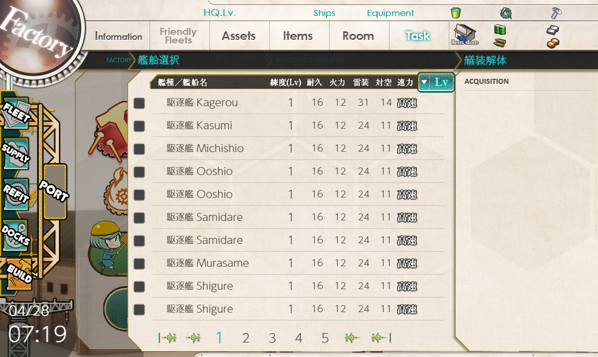

# KanColleEn - Kantai Collection English localization

[](https://app.codacy.com/app/JediKnightChan/KanColleEn?utm_source=github.com&utm_medium=referral&utm_content=JediKnightChan/KanColleEn&utm_campaign=Badge_Grade_Dashboard)

KanColleEn uses MITMProxy for replacing game data on Japanese with translated content

## Screenshots




## Warning

### Open Beta Test

Not properly tested yet.

Accounts banned: 0/1 (0%)

There **is** a potential risk. (Though no malicious
scripts such as hash checkers have been found yet)

## Translation Progress

### Interface
-   Main game menu (ring menu)
-   Side game menu
-   "Build" tab
-   "Docks" tab

### API
-   Quests
-   Fleet girls' names

## Installation

-   Download this repository or git clone it, cd to it

    ```sh
    $ git clone https://github.com/JediKnightChan/KanColleEn.git
    $ cd KanColleEn
    ```

-   ***Do you have Python3?***

    -   If yes, install mitmproxy via PIP3. 
        ```sh
        $ pip3 install mitmproxy
        ```
        > MITMProxy will be installed to your Python/Scripts directory, so you will be able to start it from any directory,
        > if your Python3 is added to your PATH variable (most probably it is)

    ***Don't have Python3 installed?***

    -   Install MITMProxy from their [official site](https://mitmproxy.org/ "link title")

        > You will have to find the path to MITMProxy, eg "C:/Program Files (x86)/mitmproxy/bin/" (Windows)

-   Start one of the 3 MITMProxy programs (mitmdump/mitmweb/mitmproxy) and pass KanColleEn.py to it
    ```sh
    > mitmdump.exe --set anticache -s ./KanColleEn.py
    ```
    ```sh
    $ mitmdump --set anticache -s ./KanColleEn.py
    ```

-   Set 127.0.0.1:8080 as your proxy server
    (You can open your browser settings and search for "proxy")

-   Optional: go to [mitm.it](http://mitm.it/ "link title") and install certificate
    if you are going to use https web-sites during gameplay

-   Clear your browser cache

-   Enable official English interface in your game preferences
    (Main menu (Port) - right bottom "Settings" button - Interface mode - last option - "Settings" button)

## Features

-   Can translate game interface
-   **NEW: Can translate fleet girls' names and quests**
-   TODO: add other game API translation (dialogues, etc)
-   TODO: handle fonts (change interface font, change fleet girls' names font size)

## Support
-   Bitcoin (recommended): 1PBMD7w7w9vEeBERhiuUpjwihecDTmbp9G
-   [Patreon](https://www.patreon.com/jediknightchannel)
-   [Donation alerts](https://www.donationalerts.com/r/jediknightchannel) (not recommended at all)

**ALL HAIL BRITANNIA!**

***API translation is taken from 
[kc3-translations](https://github.com/KC3Kai/kc3-translations/tree/4b655609e1c5290d28700d6aabd5eeb1a6938f26) 
repo. Thanks to translators!***

***All rights reversed***