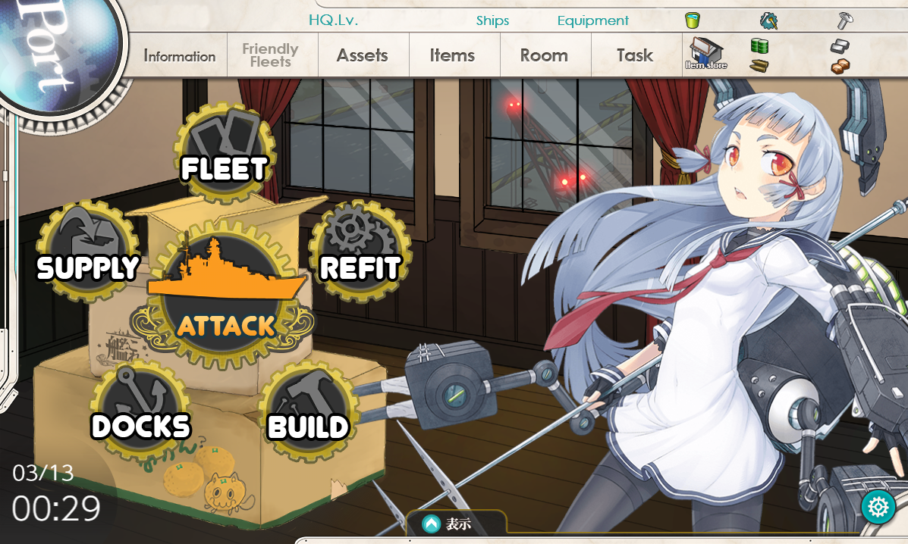

# KanColleEn - Kantai Collection English localization

[](https://app.codacy.com/app/JediKnightChan/KanColleEn?utm_source=github.com&utm_medium=referral&utm_content=JediKnightChan/KanColleEn&utm_campaign=Badge_Grade_Dashboard)

KanColleEn uses MITMProxy for replacing game data on Japanese with translated content

## Screenshots


## Warning
### Open Beta Test
Not properly tested yet and not ready for mass distribution

Accounts banned: 0/1 (0%)

There **is** a potential risk. (Though no malicious
scripts such as hash checkers have been found yet)

## Translation Progress
- Main game menu (ring menu)
- Side game menu
- "Build" tab

## Installation
- Download this repository or git clone it, cd to it
  ```bash
    $ git clone https://github.com/JediKnightChan/KanColleEn.git
    $ cd KanColleEn
    ```
  
- ***Do you have Python3?***

  - If yes, install mitmproxy via PIP3. 
    ```bash
    $ pip3 install mitmproxy
    ```
    > MITMProxy will be installed to your Python/Scripts directory, so you will be able to start it from any directory,
    if your Python3 is added to your PATH variable (most probably it is)
  
  ***Don't have Python3 installed?***
  
  - Install MITMProxy from their [official site](https://mitmproxy.org/ "link title")
    > You will have to find the path to MITMProxy, eg "C:/Program Files (x86)/mitmproxy/bin/" (Windows)
  
- Start one of the 3 MITMProxy programs (mitmdump/mitmweb/mitmproxy) and pass KanColleEn.py to it
    ```cmd
    > mitmdump.exe --set anticache -s ./KanColleEn.py
    ```
    ```bash
    $ mitmdump --set anticache -s ./KanColleEn.py
    ```
- Set 127.0.0.1:8080 as your proxy server
(You can open your browser settings and search for "proxy")
- Optional: go to [mitm.it](http://mitm.it/ "link title") and install certificate
if you are going to use https web-sites during gameplay
- Enable official English interface in your game preferences
(Main menu (Port) - right bottom "Settings" button - Interface mode - last option - "Settings" button)
    
## Features
- Can translate game interface
- TODO: add game API translation (dialogues, quests, fleet girls, etc)

**ALL HAIL BRITANNIA!**

***All rights reversed***